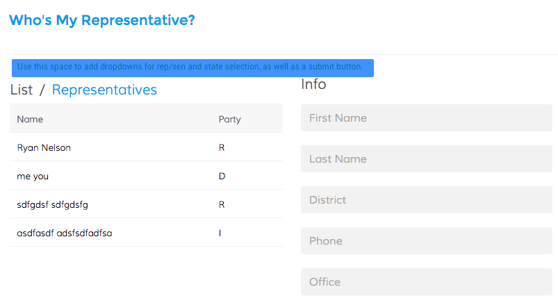

# React Exercise for Grow
 

For this programming test you are tasked with creating an interface around the open API located at http://whoismyrepresentative.com/api. However, to get around CORs limitation, we are providing an extremely simple node application that will act as a layer between your client app and the API. That application can be found at https://github.com/hillmanov/find-rep-api. Follow the instructions in that repo’s README to get everything up and running. Once again,  you will be using that node app as your API - you will not be accessing whoismyrepresentative.com directly from your client side app.

##### In your client side application, you will be making use of two of the endpoints that are offered:

* `/representatives/:state`
* `/senators/:state`

##### Your application should allow the user to:

* Select if he/she would like to search by Representative or by Senator
* Select which state to return results for
* View a results list after #1 and #2 have been selected
* Display name and party affiliation
* View more information about the representative/senator by clicking on his/her name in the results list (district,  phone, office and a link to his/her website)

Your website should be built using React and match the provided design:

##### Priorities:

* Functionality
* Design
* Code organization
* Proper error handling (make sure they select something before clicking on the button to fetch results)

If you have any questions, please let us know.  
